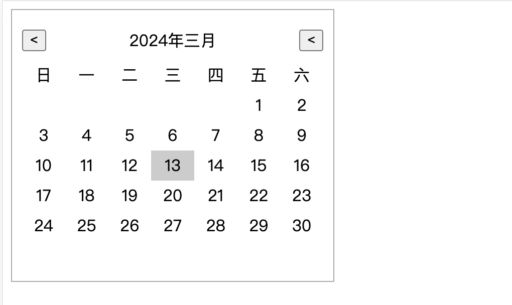

# mini 日历组件 Calendar

## 依赖安装

```tsx
pnpm i
```

## 运行

```tsx
pnpm start
```

## 示例

```tsx
import Calendar from "@/component/Calendar";

export default function HomePage() {
  return (
    <div>
      <Calendar
        onChange={() => {
          console.log("ss");
        }}
      ></Calendar>
    </div>
  );
}
```

效果展示


## 参数说明

|   参数   |      说明      |              类型              | 默认值 |
| :------: | :------------: | :----------------------------: | :----: |
|  value   |    展示日期    |             string             |   -    |
| onChange | 日期变化的回调 | `function(date: Date) => void` |   -    |
